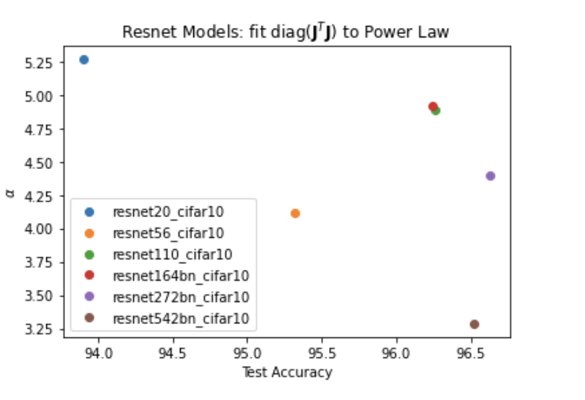
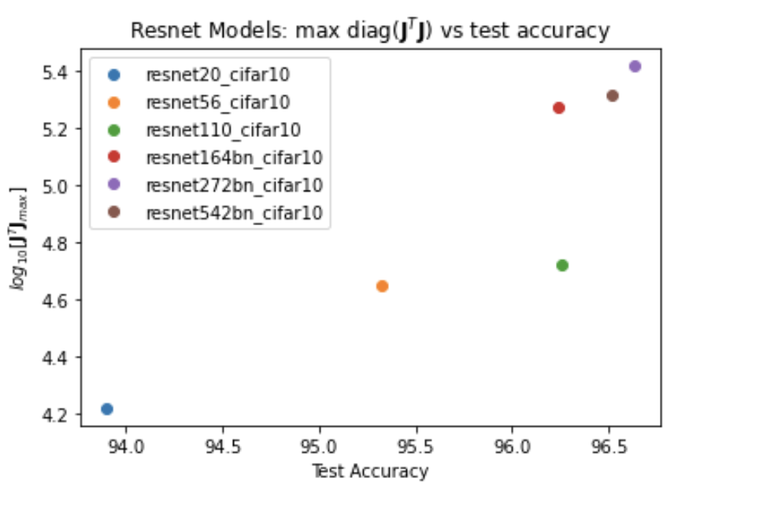
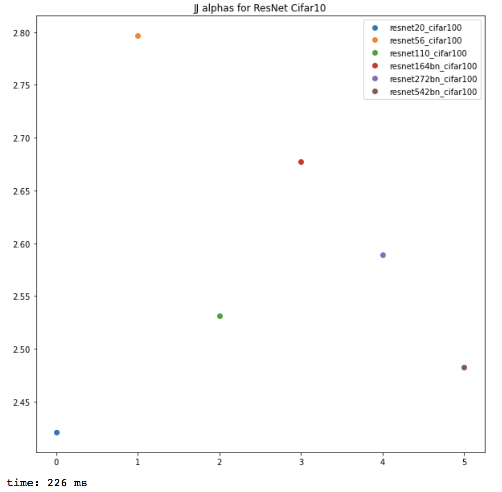
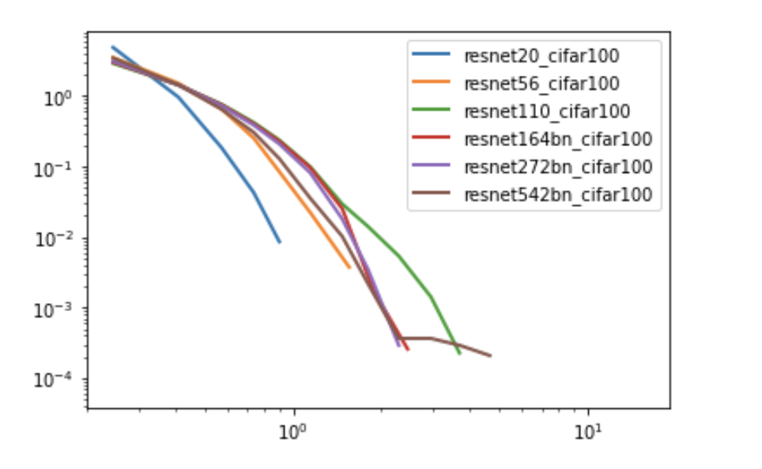

### Orginal Jacobian Colab Notebooks 

#### for  input output Jacobian, shaped by n X kd

(Also just called Jacobian in other folders)

- n:  number of test (or training) data ppints
- k:  number of output classes 
- d:  dimension of input

For CIFAR10, n=10000, k=10, and d=3*32*32

Resnet CIFAR10  models trained (in memory) (resnet20, 56, 110, 164bn, 272bn)

Jacobian ESDs computed over test data in full (using LAPAC eigh)

#### Diagonal Jaocobian

refers to diagonal elements of **JTJ**
and not the diag_j() methods in the jacobian.py lib

- [Jacobians_Resnets_old.ipynb](https://github.com/CalculatedContent/ww-phys_theory/blob/master/Jinout_n_X_kd/Jacobians_Resnets_old.ipynb)  old code for computing Jacobian diagonal.  
  Did *not* set model.eval() so results may be off.  Replaced by Fast_J_Diag_Resnets.ipynb

  [Fast_J_Diag_Resnets.ipynb](https://github.com/CalculatedContent/ww-phys_theory/blob/master/Jinout_n_X_kd/Fast_J_Diag_Resnets.ipynb)  Computing Jacobian diagonal using fast code 
  Saves models files:   /content/drive/My Drive/resnets_fast/Jdiag_fast_{}__{}.csv   
  Does not use jacobian.py library yet.   (previously FastJacobianDiag_Resnets.ipynb)  

- [J_Diag_PLfits.ipynb](https://github.com/CalculatedContent/ww-phys_theory/blob/master/Jinout_n_X_kd/J_Diag_PLfits.ipynb) comparison of PL alpha fits on ResNet CIFAR10 models 
  Reads diagonal  **JTJ** from local  csv files on Google Drive

- [Analyze_Diag_Jacobians.ipynb](https://github.com/CalculatedContent/ww-phys_theory/blob/master/Jinout_n_X_kd/Analyze_Diag_Jacobians.ipynb) Another older notebook used to analyze the diagonal Jacobian

#### Full Jacobians

- [Make_n_Save_JJMat_ResNets.ipynb](https://github.com/CalculatedContent/ww-phys_theory/blob/master/Jinout_n_X_kd/Make_n_Save_JJMat_ResNets.ipynb)   Make ResNet Jacobians correlation matrix JJMat in memory and save to Google Drive

#### Batched Calculations

Long calculations of very large Jacobians have been batches and the
correlation matrix **JTJ** stored on Google Drive

- [Make_Batched_n_Save_JJMat_Resnets.ipynb](https://github.com/CalculatedContent/ww-phys_theory/blob/master/Jinout_n_X_kd/Make_n_Save_JJMat_ResNets.ipynb)   Make ResNet Jacobians correlation matrix JJMat in memory **in batch** for large models like ResNet1001 save to Google Drive, for SVD analysis later

- [Full_Test_Jacobians_Resnets_SVD.ipynb](https://github.com/CalculatedContent/ww-phys_theory/blob/master/Jinout_n_X_kd/Full_Test_Jacobians_Resnets_SVD.ipynb) Basically the same as the above Make_Batched_n_Save_JJMat_Resnets.ipynb.  Need to review the differences, usually I run multple copies of this at once on Google Colab.  Generates inputs for the notebook below

- [Full_Test_Jacobians_Resnets_SVD_only.ipynb.ipynb](https://github.com/CalculatedContent/ww-phys_theory/blob/master/Jinout_n_X_kd/Full_Test_Jacobians_Resnets_SVD_only.ipynb) Analysis of Full teest data JJMat 

- [Full_JJMat_Batched_Check.ipynb](https://github.com/CalculatedContent/ww-phys_theory/blob/master/Jinout_n_X_kd/Full_JJMat_Batched_Check.ipynb) Check that the batched and in-memory full JJMat calculations

### Results so far

The Jacobian has been form several pretrained ResNet models, on CIFAR10 and CIFAR100, using the test dat

We have examined both the digaonal elements of **JTJ** as well as the full ESD

#### Resnets CIFAR10  Diagonal
(Note: older and newer results differ)

 
<h4> Full ESD CIFAR10 </h4>
Full ESD Alphas for CIFAR100

 
<h4> Full ESD CIFAR100 </h4>
Overlay of actual ESD PDFs for CIFAR100
